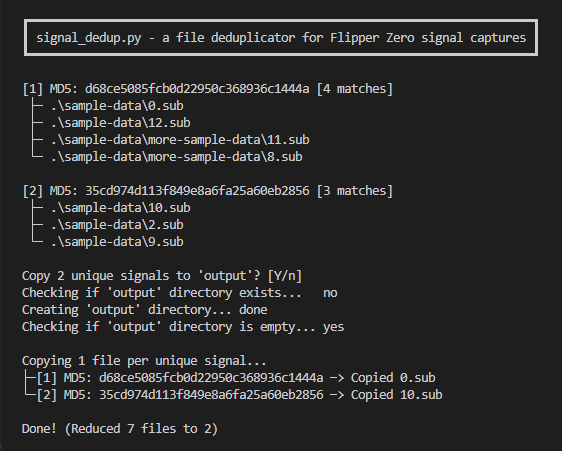

# flipper-signal-deduplicator

MD5 hashes captured signal data (.sub files) to identify duplicates, then copies only unique signals to `./output` directory.

Copy `signal_dedup.py` to the folder containing your `.sub` files and run it, or vice versa.   
Unique `.sub` files will be copied to the `output` directory.

Written with Python 3.9.13 using only standard libraries. ♡
